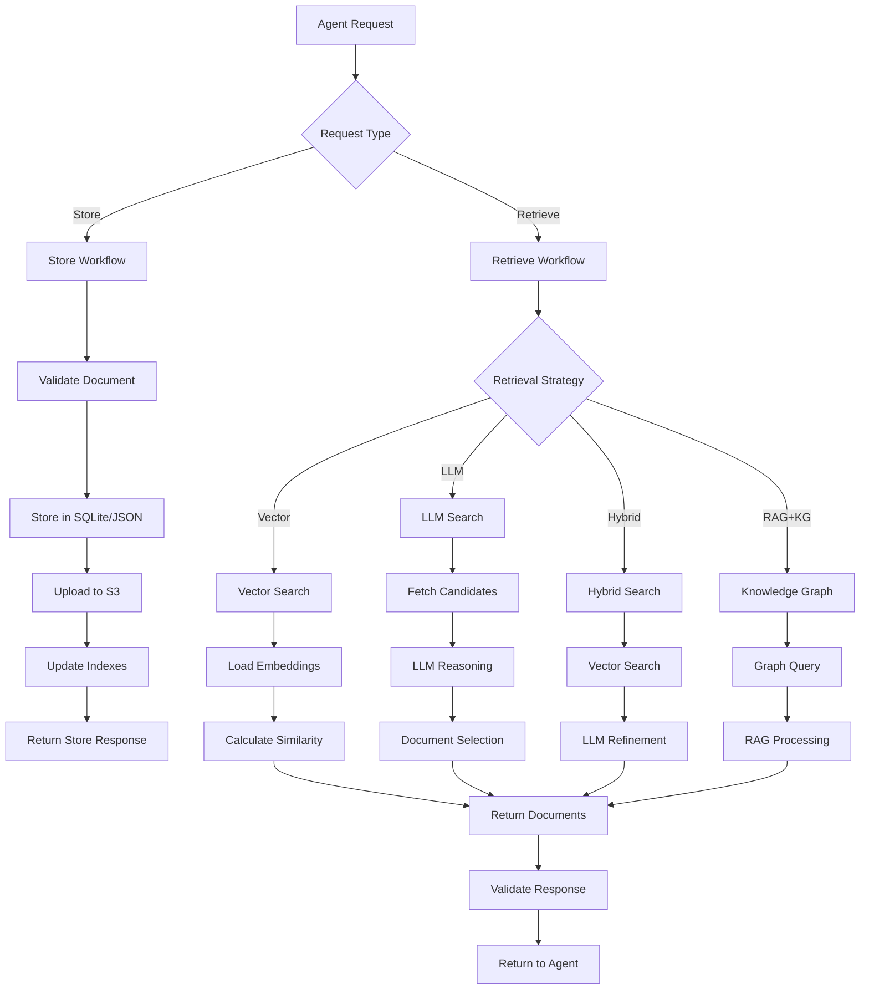
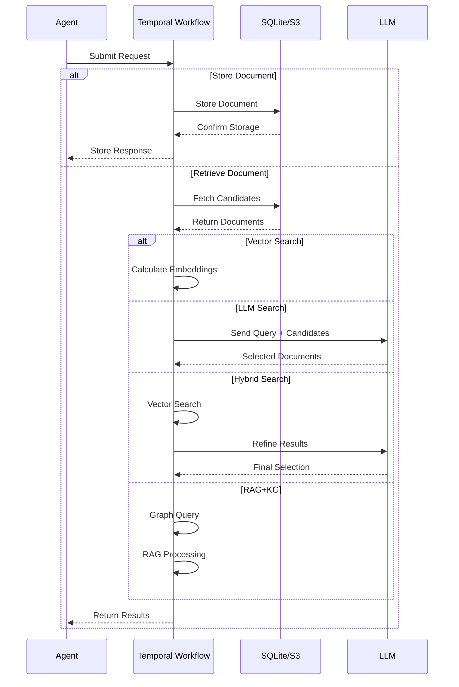
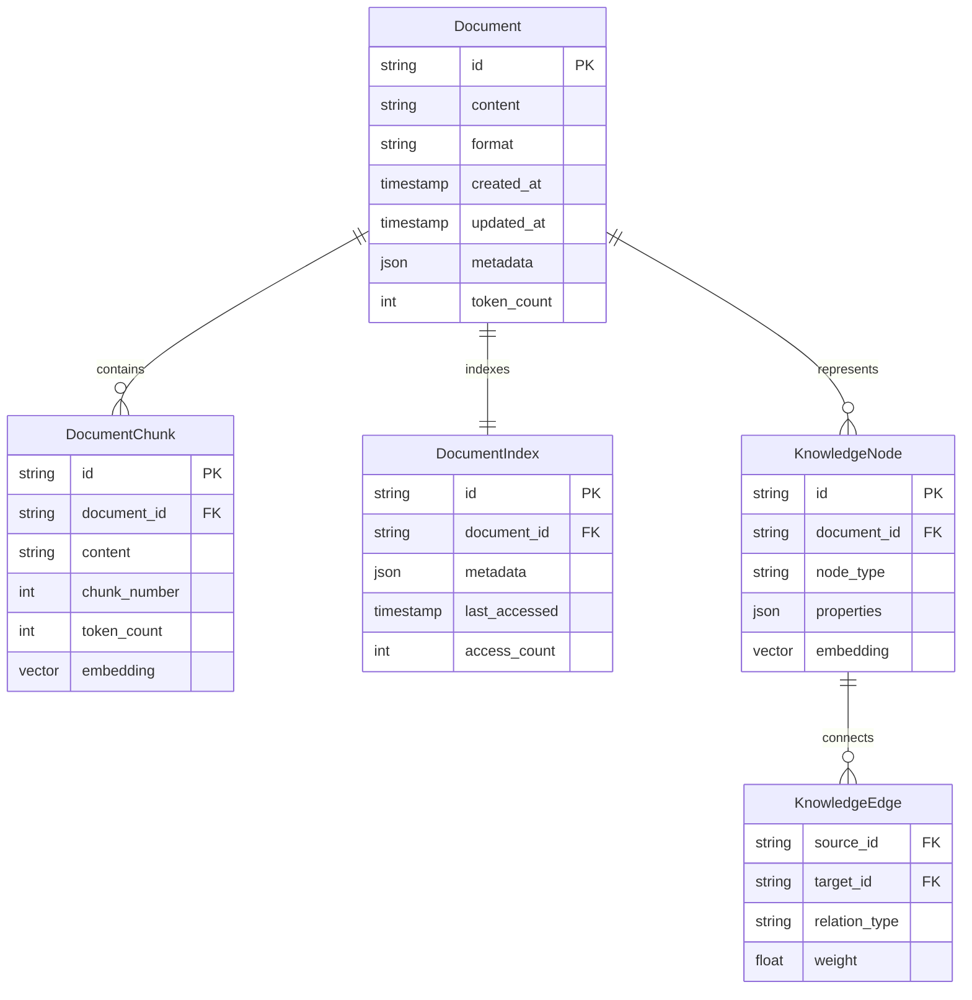
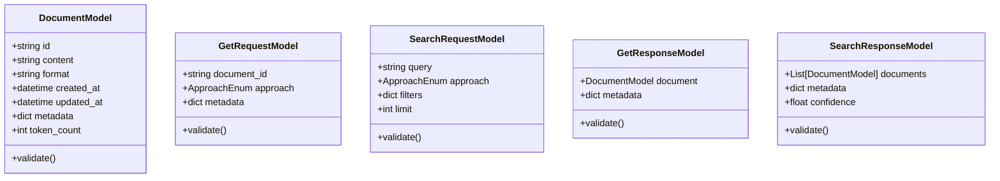
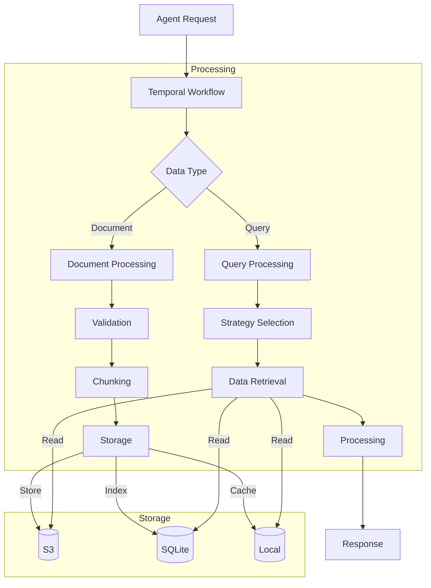

# Product Requirements Document (PRD)

# 1. INTRODUCTION

## 1.1 Purpose

This Software Requirements Specification (SRS) document provides a comprehensive description of the Memory Agent system - a Temporal workflow-based document storage and retrieval service. This document serves as the primary reference for technical requirements and system behavior for:

- Development team implementing the Memory Agent
- System architects designing the integration points
- QA engineers validating system behavior
- Project stakeholders evaluating feature completeness

## 1.2 Scope

The Memory Agent system encompasses:

- A Temporal workflow service for document storage and retrieval
- Four distinct retrieval strategies:
  - Vector-based embedding search
  - LLM-based contextual selection
  - Hybrid approach combining vectors and LLM
  - Vector with Knowledge Graphs
- Local document storage using SQLite/JSON
- S3-based cloud storage integration (minio)
- LLM integration for intelligent document selection
- Pydantic models for structured data validation

Key Features:

- Document storage and indexing
- Multi-modal retrieval approaches
- Token-aware document chunking
- Fault-tolerant workflow execution
- Secure API access controls

Out of Scope:

- User interface or frontend components
- Direct end-user interactions
- Document content generation
- Real-time collaboration features
- Document version control

The system will primarily serve as an intelligent memory layer for LLM-based agents and the Executor orchestrating them, focusing on accurate and context-aware document retrieval.

# 2. PRODUCT DESCRIPTION

## 2.1 Product Perspective

The Memory Agent operates as a critical component within a larger LLM-based agent ecosystem, serving as the intelligent memory layer that enables contextual document storage and retrieval. The system interfaces with:

- Temporal Workflow Engine: For orchestrating storage and retrieval operations
- S3 Cloud Storage: For persistent document storage
- Local SQLite/JSON Storage: For efficient document indexing and caching
- LLM API Services: For contextual document selection and reasoning
- Agent Ecosystem: Providing memory services to other LLM-based agents and the Executor

## 2.2 Product Functions

The Memory Agent provides these core functions:

1. Document Storage and Management

   - Store documents in local SQLite/JSON and S3  
     Store logs about action taken by other agents  
     Keep track on which agent provided data, what kind of data, etc
   - Maintain document metadata and indexes
   - Handle document chunking and token management

2. Multi-Strategy Document Retrieval

   - Vector-based embedding search
   - Pure LLM-based contextual selection
   - Hybrid vector and LLM approach
   - RAG with Knowledge Graphs integration

3. Workflow Management

   - Fault-tolerant document operations
   - Activity-based storage and retrieval
   - Asynchronous processing capabilities

4. Data Validation and Schema Enforcement

   - Pydantic model validation for all inputs/outputs
   - Structured document format verification
   - Schema-compliant response generation

## 2.3 User Characteristics

Primary Users:

1. LLM-based Agents

   - Automated systems requiring document access
   - Variable query complexity needs
   - Programmatic API interaction

2. Executor System

   - Orchestrates agent interactions
   - Manages document storage operations
   - Requires high reliability and consistency

3. System Developers

   - Python development expertise
   - Temporal workflow knowledge
   - Understanding of LLM capabilities

## 2.4 Constraints

Technical Constraints:

- S3 storage capacity and cost considerations
- Temporal workflow execution limitations
- Python runtime environment requirements

Operational Constraints:

- No direct user interface
- Asynchronous operation requirements
- API-only access pattern (gRPC/proto would be ideal)
- Limited to supported document formats (Markdown/JSON)

Performance Constraints:

- LLM API response latency
- Document chunking overhead
- Storage I/O limitations
- Network bandwidth requirements

## 2.5 Assumptions and Dependencies

Assumptions:

- Stable LLM API availability
- Sufficient computing resources for workflow execution
- Reliable network connectivity
- Adequate storage capacity in S3  
  Files and data is provided as markdown context or json blobs

Dependencies:

- Temporal server deployment
- S3-compatible storage service (Use minio instead
- LLM API service availability
- Python runtime environment
- SQLite or JSON storage capability
- Network access to all required services

# 3. PROCESS FLOWCHART





# 4. FUNCTIONAL REQUIREMENTS

## 4.1 Document Storage and Management

### ID: F1

### Description

Core document storage functionality including local and cloud persistence, metadata management, and document chunking.

### Priority

High

### Requirements

| ID | Requirement | Priority |
| --- | --- | --- |
| F1.1 | Store documents in SQLite/JSON local storage with metadata | High |
| F1.2 | Upload documents to S3 cloud storage for persistence | High |
| F1.3 | Maintain document indexes for efficient retrieval | High |
| F1.4 | Implement token-aware document chunking | Medium |
| F1.5 | Validate all documents against Pydantic schemas | High |
| F1.6 | Support both Markdown and JSON document formats | High |

## 4.2 Vector-Based Retrieval

### ID: F2

### Description

Embedding-based document search functionality using vector similarity.

### Priority

High

### Requirements

| ID | Requirement | Priority |
| --- | --- | --- |
| F2.1 | Generate and store document embeddings | High |
| F2.2 | Implement vector similarity search | High |
| F2.3 | Return ranked results based on similarity scores | High |
| F2.4 | Cache embeddings for frequent queries | Medium |
| F2.5 | Handle embedding updates when documents change | Medium |

## 4.3 LLM-Based Retrieval

### ID: F3

### Description

Pure LLM-based contextual document selection without embeddings.

### Priority

High

### Requirements

| ID | Requirement | Priority |
| --- | --- | --- |
| F3.1 | Fetch candidate documents based on metadata | High |
| F3.2 | Send query and candidates to LLM for reasoning | High |
| F3.3 | Process LLM selection response | High |
| F3.4 | Handle token limits through chunking/summarization | High |
| F3.5 | Implement fallback mechanisms for LLM failures | Medium |

## 4.4 Hybrid Retrieval

### ID: F4

### Description

Combined approach using both vector search and LLM refinement.

### Priority

Medium

### Requirements

| ID | Requirement | Priority |
| --- | --- | --- |
| F4.1 | Perform initial vector-based candidate selection | High |
| F4.2 | Send vector results to LLM for refinement | High |
| F4.3 | Combine and rank final results | Medium |
| F4.4 | Optimize performance between vector and LLM steps | Medium |

## 4.5 RAG with Knowledge Graphs

### ID: F5

### Description

Retrieval-augmented generation using knowledge graph integration.

### Priority

Medium

### Requirements

| ID | Requirement | Priority |
| --- | --- | --- |
| F5.1 | Build and maintain knowledge graph | High |
| F5.2 | Execute graph queries for document retrieval | High |
| F5.3 | Integrate RAG processing with graph results | High |
| F5.4 | Update knowledge graph as documents change | Medium |
| F5.5 | Handle graph traversal optimization | Low |

## 4.6 Workflow Management

### ID: F6

### Description

Temporal workflow orchestration and activity management.

### Priority

High

### Requirements

| ID | Requirement | Priority |
| --- | --- | --- |
| F6.1 | Implement core storage workflow | High |
| F6.2 | Implement retrieval workflow with strategy selection | High |
| F6.3 | Handle activity retries and failures | High |
| F6.4 | Manage workflow state and history | Medium |
| F6.5 | Implement workflow signals and queries | Medium |

## 4.7 API Integration

### ID: F7

### Description

External service integration and API management.

### Priority

High

### Requirements

| ID | Requirement | Priority |
| --- | --- | --- |
| F7.1 | Integrate with S3 API | High |
| F7.2 | Integrate with LLM API service | High |
| F7.3 | Implement secure API access | High |
| F7.4 | Handle API rate limiting | Medium |
| F7.5 | Monitor API performance and errors | Medium |

# 5. NON-FUNCTIONAL REQUIREMENTS

## 5.1 Performance Requirements

| Requirement | Description | Target Metric |
| --- | --- | --- |
| Response Time | Maximum time for document retrieval | Vector: \< 500ms<br>LLM: \< 3000ms<br>Hybrid: \< 3500ms<br>RAG+KG: \< 4000ms |
| Throughput | Number of concurrent requests handled | 50 requests/second |
| Resource Usage | Maximum memory consumption | 4GB per worker instance |
| Storage Performance | Document storage operation time | \< 200ms for local storage<br>\< 1000ms for S3 upload |
| Caching Efficiency | Cache hit ratio for frequent queries | \> 80% |
| Token Processing | Maximum tokens processed per request | 16K tokens for GPT-3.5<br>32K tokens for GPT-4 |

## 5.2 Safety Requirements

| Requirement | Description | Implementation |
| --- | --- | --- |
| Data Backup | Regular backup of stored documents | Daily S3 snapshots |
| Failure Recovery | System recovery after crashes | Temporal workflow retry mechanism |
| Data Consistency | Maintain consistency across storage layers | Two-phase commit for storage operations |
| Error Handling | Graceful handling of system failures | Fallback strategies for each retrieval method |
| Resource Limits | Prevent resource exhaustion | Memory limits per workflow<br>CPU usage caps per worker |
| State Management | Preserve workflow state during failures | Temporal persistence layer |

## 5.3 Security Requirements

| Requirement | Description | Implementation |
| --- | --- | --- |
| Authentication | Secure access to system resources | JWT-based authentication |
| Authorization | Role-based access control | Temporal namespace permissions |
| Data Encryption | Protect sensitive information | At-rest encryption for S3<br>TLS for data in transit |
| API Security | Secure API endpoints | API key authentication<br>Rate limiting |
| Audit Logging | Track system access and operations | Temporal workflow history<br>S3 access logs |
| Secret Management | Secure credential handling | Environment variables<br>AWS KMS integration |

## 5.4 Quality Requirements

### 5.4.1 Availability

- System uptime: 99.9%
- Maximum planned downtime: 4 hours/month
- Automatic failover capability
- Multiple availability zone deployment

### 5.4.2 Maintainability

- Modular code architecture
- Comprehensive documentation
- Automated testing coverage \> 80%
- Clear dependency management
- Standardized logging format

### 5.4.3 Usability

- Clear API documentation
- Consistent error messages
- Predictable behavior across retrieval strategies
- Structured response formats
- Graceful degradation under load

### 5.4.4 Scalability

- Horizontal scaling of workers
- Auto-scaling based on load
- Partitioned storage for large datasets
- Distributed caching support
- Load balancing across instances

### 5.4.5 Reliability

- Maximum error rate: 0.1%
- Automated health checks
- Circuit breakers for external services
- Data consistency verification
- Automated recovery procedures

## 5.5 Compliance Requirements

| Requirement | Description | Implementation |
| --- | --- | --- |
| Data Privacy | Compliance with privacy regulations | Data anonymization<br>Access controls<br>Audit trails |
| API Standards | RESTful API compliance | OpenAPI specification<br>Standard HTTP methods |
| Code Quality | Adherence to coding standards | PEP 8 compliance<br>Static code analysis |
| Documentation | Technical documentation standards | API documentation<br>Code comments<br>Architecture diagrams |
| Testing | Quality assurance requirements | Unit tests<br>Integration tests<br>Performance tests |
| Monitoring | System monitoring standards | Metrics collection<br>Alert thresholds<br>Performance monitoring |

# 6. DATA REQUIREMENTS

## 6.1 Data Models

### 6.1.1 Core Data Entities



### 6.1.2 Pydantic Models



## 6.2 Data Storage

### 6.2.1 Storage Architecture

| Storage Layer | Purpose | Implementation |
| --- | --- | --- |
| Primary Storage | Document content and metadata | S3 with versioning |
| Local Cache | Frequently accessed documents | SQLite/JSON files |
| Index Storage | Document lookup and metadata | SQLite database |
| Vector Storage | Document embeddings | Optional vector database |
| Graph Storage | Knowledge graph data | Optional graph database |

### 6.2.2 Data Retention

| Data Type | Retention Period | Storage Location |
| --- | --- | --- |
| Documents | Indefinite | S3 + Local Cache |
| Embeddings | 90 days (regenerate) | Vector DB |
| Indexes | Dynamic | SQLite |
| Access Logs | 30 days | S3 |
| Workflow History | 30 days | Temporal |

### 6.2.3 Backup and Recovery

| Component | Backup Frequency | Recovery SLA | Method |
| --- | --- | --- | --- |
| S3 Documents | Daily | 4 hours | S3 cross-region replication |
| SQLite/JSON | Hourly | 1 hour | S3 snapshot |
| Vector DB | Weekly | 24 hours | Database backup |
| Graph DB | Daily | 12 hours | Database backup |
| Workflow State | Real-time | Immediate | Temporal persistence |

## 6.3 Data Processing

### 6.3.1 Data Flow



### 6.3.2 Data Security

| Security Layer | Implementation | Purpose |
| --- | --- | --- |
| Encryption at Rest | S3 SSE-KMS | Document storage |
| Encryption in Transit | TLS 1.3 | API communication |
| Access Control | IAM + JWT | Authentication |
| Data Isolation | Temporal namespaces | Multi-tenant separation |
| Audit Logging | CloudTrail + Custom | Compliance tracking |

### 6.3.3 Data Validation

| Stage | Validation Type | Implementation |
| --- | --- | --- |
| Input | Schema | Pydantic models |
| Storage | Format | Content type checks |
| Processing | Token limits | LLM constraints |
| Output | Response format | Pydantic models |
| Integrity | Checksums | SHA-256 hashing |

# 7. EXTERNAL INTERFACES

## 7.1 Software Interfaces

### 7.1.1 S3 Storage Interface

| Interface | Description | Protocol |
| --- | --- | --- |
| AWS S3 API | Document storage and retrieval | HTTPS/REST |
| Authentication | AWS IAM credentials | AWS Signature V4 |
| Operations | GET, PUT, DELETE, LIST | REST API calls |
| Data Format | Binary/JSON/Markdown | Content-Type headers |

### 7.1.2 LLM API Interface

| Interface | Description | Protocol |
| --- | --- | --- |
| OpenAI API | Document reasoning and selection | HTTPS/REST |
| Authentication | API key | Bearer token |
| Endpoints | /v1/chat/completions | REST API |
| Request Format | JSON with context and query | Application/JSON |
| Response Format | JSON with selections | Application/JSON |

### 7.1.3 Temporal Interface

| Interface | Description | Protocol |
| --- | --- | --- |
| Temporal Server | Workflow orchestration | gRPC |
| Authentication | mTLS certificates | TLS 1.3 |
| Operations | Start/Signal/Query workflows | gRPC calls |
| Data Format | Protocol Buffers | Binary |

### 7.1.4 SQLite Interface

| Interface | Description | Protocol |
| --- | --- | --- |
| SQLite DB | Local document indexing | File I/O |
| Connection | Direct file access | SQLite3 API |
| Operations | CRUD operations | SQL |
| Data Format | SQLite database file | Binary |

## 7.2 Communication Interfaces

### 7.2.1 Network Protocols

| Protocol | Usage | Port |
| --- | --- | --- |
| HTTPS | REST API communication | 443 |
| gRPC | Temporal communication | 7233 |
| TCP/IP | Internal network traffic | Various |

### 7.2.2 Data Exchange Formats

| Format | Usage | Schema |
| --- | --- | --- |
| JSON | API requests/responses | Pydantic models |
| Protocol Buffers | Temporal communication | Temporal SDK |
| Markdown | Document content | CommonMark |
| Binary | S3 object storage | Raw bytes |

### 7.2.3 API Endpoints

```mermaid
graph LR
    A[Memory Agent] --> B{API Endpoints}
    B --> C[/store]
    B --> D[/retrieve]
    B --> E[/search]
    B --> F[/health]
    
    C --> G[POST /store]
    D --> H[GET /retrieve/{id}]
    E --> I[POST /search]
    F --> J[GET /health]
```

## 7.3 Storage Interfaces

### 7.3.1 Primary Storage Interface

| Component | Interface Type | Implementation |
| --- | --- | --- |
| S3 Storage | AWS SDK | boto3 client |
| Bucket Operations | REST API | S3 endpoints |
| Object Lifecycle | API calls | S3 lifecycle rules |
| Versioning | S3 versioning | AWS versioning API |

### 7.3.2 Local Storage Interface

| Component | Interface Type | Implementation |
| --- | --- | --- |
| SQLite | Python sqlite3 | File-based DB |
| JSON Files | File I/O | aiofiles |
| File System | OS calls | async file operations |
| Cache | Memory | LRU cache |

## 7.4 Service Integration Interfaces

### 7.4.1 Authentication Interfaces

| Service | Auth Method | Implementation |
| --- | --- | --- |
| S3 | IAM | AWS credentials |
| LLM API | API Key | Environment variables |
| Temporal | mTLS | Certificate files |
| Internal APIs | JWT | Bearer tokens |

### 7.4.2 Monitoring Interfaces

| Component | Interface | Protocol |
| --- | --- | --- |
| Metrics | Prometheus | HTTP |
| Logging | CloudWatch | AWS SDK |
| Tracing | OpenTelemetry | OTLP |
| Alerts | SNS | AWS SDK |

# 8. APPENDICES

## 8.1 GLOSSARY

| Term | Definition |
| --- | --- |
| Document Chunking | Process of breaking down large documents into smaller segments that fit within LLM token limits |
| Embedding | Vector representation of text that captures semantic meaning for similarity search |
| Knowledge Graph | A structured representation of information showing relationships between entities |
| RAG | Retrieval-Augmented Generation - technique combining retrieved documents with LLM generation |
| Token | Basic unit of text processing for LLMs, roughly corresponding to word parts |
| Vector Search | Document retrieval method using similarity between numerical vector representations |
| Workflow | A sequence of activities orchestrated by Temporal to accomplish a task |

## 8.2 ACRONYMS

| Acronym | Expansion |
| --- | --- |
| API | Application Programming Interface |
| CRUD | Create, Read, Update, Delete |
| IAM | Identity and Access Management |
| JWT | JSON Web Token |
| KG | Knowledge Graph |
| LLM | Large Language Model |
| LRU | Least Recently Used |
| mTLS | mutual Transport Layer Security |
| OTLP | OpenTelemetry Protocol |
| PRD | Product Requirements Document |
| RAG | Retrieval-Augmented Generation |
| REST | Representational State Transfer |
| S3 | Simple Storage Service |
| SDK | Software Development Kit |
| SNS | Simple Notification Service |
| SQL | Structured Query Language |
| SRS | Software Requirements Specification |
| SSE | Server-Side Encryption |
| TLS | Transport Layer Security |

## 8.3 ADDITIONAL REFERENCES

| Resource | Description | URL |
| --- | --- | --- |
| Temporal Documentation | Official Temporal workflow documentation | https://docs.temporal.io |
| OpenAI API Reference | LLM API integration documentation | https://platform.openai.com/docs |
| AWS S3 SDK | Python boto3 S3 documentation | https://boto3.amazonaws.com/v1/documentation/api/latest/reference/services/s3.html |
| Pydantic Documentation | Data validation using Python type annotations | https://docs.pydantic.dev |
| SQLite Documentation | SQLite database implementation details | https://www.sqlite.org/docs.html |
| CommonMark Spec | Markdown format specification | https://spec.commonmark.org |
| OpenTelemetry Docs | Distributed tracing implementation | https://opentelemetry.io/docs |