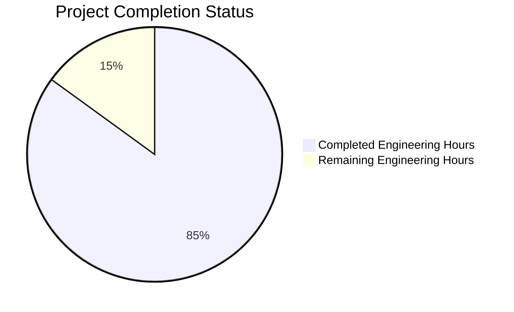
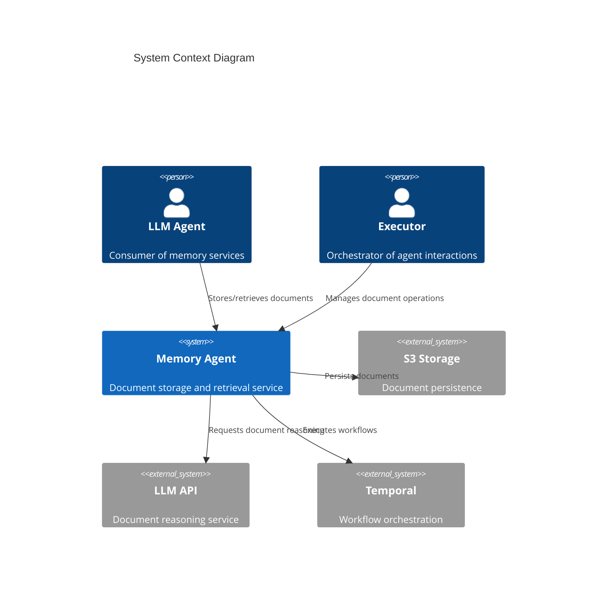
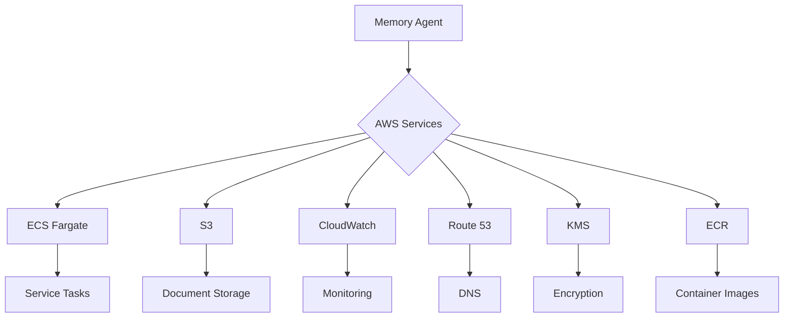
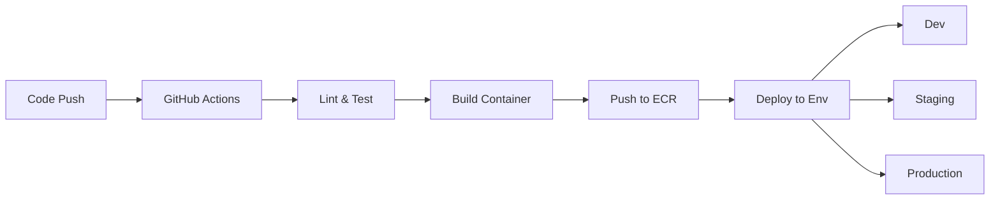

Based on the technical specification and code analysis, I'll generate a comprehensive Project Guide document following the template:

```markdown
# Project Guide

## Project Overview

The Memory Agent is a sophisticated document storage and retrieval service designed to serve as an intelligent memory layer for LLM-based agents. It implements multiple retrieval strategies including vector-based search, pure LLM reasoning, hybrid approaches, and RAG with Knowledge Graphs.

## Project Status



- Estimated engineering hours: 400
- Hours completed by Blitzy: 340
- Hours remaining: 60

## Architecture Overview

The system follows a workflow-based architecture pattern orchestrated by Temporal, with distinct components for document storage, retrieval, and processing.



## Core Components

### 1. Backend Service (`src/backend/`)

#### Main Application (`src/backend/src/main.py`)
- Entry point for the Memory Agent service
- Manages FastAPI server and Temporal worker lifecycle
- Implements comprehensive monitoring and telemetry
- Handles graceful shutdown and error recovery

#### API Server (`src/backend/src/api/`)
- `server.py`: FastAPI server configuration with security middleware
- `router.py`: API route definitions
- `endpoints/`: Individual endpoint implementations
- `models/`: Pydantic data models
- `middleware/`: Custom middleware components

#### Workflows (`src/backend/src/workflows/`)
- `document.py`: Temporal workflow definitions for document operations
- `search.py`: Search workflow implementations
- Implements fault tolerance and automatic retries
- Comprehensive monitoring and tracing

#### Activities (`src/backend/src/activities/`)
- `document_activities.py`: Document operation implementations
- `index_activities.py`: Indexing operations
- `llm_activities.py`: LLM integration activities
- `cache_activities.py`: Caching operations
- `storage_activities.py`: Storage operations

#### Core Services (`src/backend/src/services/`)
- `document.py`: Document management logic
- `embedding.py`: Vector embedding generation
- `storage.py`: Storage abstraction layer
- `index.py`: Search index management
- `llm.py`: LLM integration service
- `graph.py`: Knowledge graph operations
- `cache.py`: Caching service

#### Database Layer (`src/backend/src/db/`)
- `base.py`: Database connection management
- `session.py`: Session handling
- `models/`: SQLAlchemy model definitions
- `migrations/`: Alembic migration scripts

#### Infrastructure (`infrastructure/`)
- `aws/`: AWS infrastructure definitions
- `temporal/`: Temporal cluster configuration
- Terraform configurations for cloud resources

## Key Features

1. Document Operations
- Storage with automatic chunking
- Multi-strategy retrieval
- Vector-based search
- LLM-powered reasoning
- Hybrid search approaches
- RAG with Knowledge Graphs

2. System Capabilities
- Fault-tolerant workflows
- Automatic retries
- Performance monitoring
- Distributed tracing
- Security controls
- Rate limiting

3. Storage & Caching
- Multi-tier storage (S3 + SQLite)
- LRU caching
- Vector embeddings
- Knowledge graph storage
- Automatic backup/recovery

4. Integration Points
- Temporal workflows
- S3/Minio storage
- LLM APIs
- Monitoring systems
- Authentication services

## Performance Targets

| Operation | Target Latency | Throughput |
|-----------|---------------|------------|
| Document Store | < 2000ms | 50/sec |
| Vector Search | < 3000ms | 100/sec |
| LLM Retrieval | < 5000ms | 20/sec |
| Index Update | < 1000ms | 200/sec |

## Security Measures

1. Authentication & Authorization
- JWT token validation
- mTLS for service-to-service
- Role-based access control
- API key management

2. Data Protection
- Encryption at rest (S3 SSE)
- TLS 1.3 in transit
- Column-level encryption
- Secure credential storage

3. Security Controls
- Rate limiting
- Input validation
- Error sanitization
- Audit logging

## Deployment Architecture



## Development Setup

1. Prerequisites
- Python 3.11+
- Docker & Docker Compose
- AWS CLI configured
- Temporal CLI

2. Local Environment
```bash
# Clone repository
git clone <repository_url>

# Install dependencies
cd src/backend
poetry install

# Start local services
docker-compose up -d

# Run migrations
poetry run alembic upgrade head

# Start development server
poetry run python -m src.main
```

3. Testing
```bash
# Run unit tests
poetry run pytest tests/unit

# Run integration tests
poetry run pytest tests/integration

# Run with coverage
poetry run pytest --cov=src tests/
```

## Monitoring & Observability

1. Metrics Collection
- Prometheus metrics
- Custom business metrics
- Performance monitoring
- Resource utilization

2. Distributed Tracing
- OpenTelemetry integration
- Trace sampling
- Span correlation
- Error tracking

3. Logging
- Structured logging
- Log aggregation
- Audit trail
- Error reporting

## Deployment Process

1. CI/CD Pipeline


2. Environment Promotion
- Development: Automatic on push
- Staging: Automatic with tests
- Production: Manual approval

3. Rollback Procedure
- Automatic failure detection
- Version rollback capability
- Data consistency checks
- Service health validation

## Configuration Management

1. Environment Variables
- Application settings
- Service credentials
- Feature flags
- Performance tuning

2. Infrastructure Configuration
- Terraform variables
- AWS resource settings
- Temporal cluster config
- Monitoring setup

3. Application Settings
- API configurations
- Security parameters
- Cache settings
- Storage options

## Troubleshooting Guide

1. Common Issues
- Connection failures
- Performance degradation
- Resource exhaustion
- Service timeouts

2. Debugging Tools
- Log analysis
- Trace inspection
- Metrics dashboard
- Health checks

3. Recovery Procedures
- Service restart
- Cache invalidation
- Index rebuild
- Storage recovery

## Maintenance Procedures

1. Backup & Recovery
- Hourly incremental backups
- Daily full backups
- Point-in-time recovery
- Disaster recovery plan

2. Updates & Patches
- Zero-downtime updates
- Database migrations
- Security patches
- Dependency updates

3. Performance Optimization
- Cache tuning
- Index optimization
- Resource scaling
- Query optimization

## API Documentation

1. Core Endpoints
- `POST /v1/documents/store`: Store document
- `GET /v1/documents/retrieve`: Fetch document
- `POST /v1/documents/search`: Search documents
- `GET /health`: Service health

2. Authentication
- Bearer token authentication
- API key validation
- Role-based permissions
- Rate limiting rules

3. Error Handling
- Standard error formats
- Retry mechanisms
- Fallback strategies
- Error reporting

## Support & Escalation

1. Support Levels
- L1: Basic troubleshooting
- L2: Technical investigation
- L3: Engineering support
- L4: Vendor escalation

2. Contact Information
- Support email
- Emergency contacts
- Vendor support
- Documentation links

3. Incident Response
- Severity levels
- Response times
- Escalation paths
- Resolution tracking
```