# Technical Specifications

# 1. INTRODUCTION

## 1.1 EXECUTIVE SUMMARY

The Memory Agent is a Temporal workflow-based document storage and retrieval service designed to serve as an intelligent memory layer for LLM-based agents. The system addresses the critical need for context-aware document retrieval by implementing multiple retrieval strategies, including vector-based search, pure LLM reasoning, hybrid approaches, and RAG with Knowledge Graphs.

This system enables agents to efficiently store, index, and retrieve documents while leveraging the contextual understanding capabilities of Large Language Models. By providing multiple retrieval strategies, the Memory Agent allows for optimal document selection based on query complexity and accuracy requirements.

## 1.2 SYSTEM OVERVIEW

### Project Context

| Aspect | Description |
| --- | --- |
| Business Context | Core component of an LLM-based agent ecosystem requiring intelligent document retrieval |
| Current Limitations | Traditional vector-only approaches lack contextual understanding |
| Enterprise Integration | Interfaces with Temporal workflows, S3 storage, and LLM services |

### High-Level Description

| Component | Implementation |
| --- | --- |
| Document Storage | Local SQLite/JSON + S3 cloud storage |
| Retrieval Strategies | Vector-based, LLM-based, Hybrid, and RAG+KG approaches |
| Workflow Engine | Temporal-based orchestration |
| Data Validation | Pydantic models for request/response validation |

### Success Criteria

| Metric | Target |
| --- | --- |
| Retrieval Accuracy | \>90% relevant document selection |
| System Availability | 99.9% uptime |
| Response Time | Vector: \<500ms, LLM: \<3000ms |
| Concurrent Requests | 50 requests/second |

## 1.3 SCOPE

### In-Scope Features

| Category | Components |
| --- | --- |
| Core Features | - Document storage and indexing<br>- Multi-strategy retrieval<br>- Token-aware chunking<br>- Fault-tolerant workflows |
| Implementation | - Temporal workflow activities<br>- S3 integration<br>- LLM API integration<br>- Local storage management |
| User Groups | - Internal LLM-based agents<br>- Executor system<br>- Development team |
| Data Domains | - Markdown documents<br>- JSON structures<br>- Document metadata |

### Out-of-Scope Elements

| Category | Excluded Items |
| --- | --- |
| Features | - User interface/frontend<br>- Document generation<br>- Real-time collaboration<br>- Version control |
| Integration | - Direct end-user access<br>- External third-party systems<br>- Legacy system migration |
| Use Cases | - Streaming document updates<br>- Multi-tenant isolation<br>- Real-time document editing |
| Technical | - Custom LLM training<br>- Document format conversion<br>- Blockchain integration |

# 2. SYSTEM ARCHITECTURE

## 2.1 High-Level Architecture

The Memory Agent follows a workflow-based architecture pattern orchestrated by Temporal, with distinct components for document storage, retrieval, and processing.

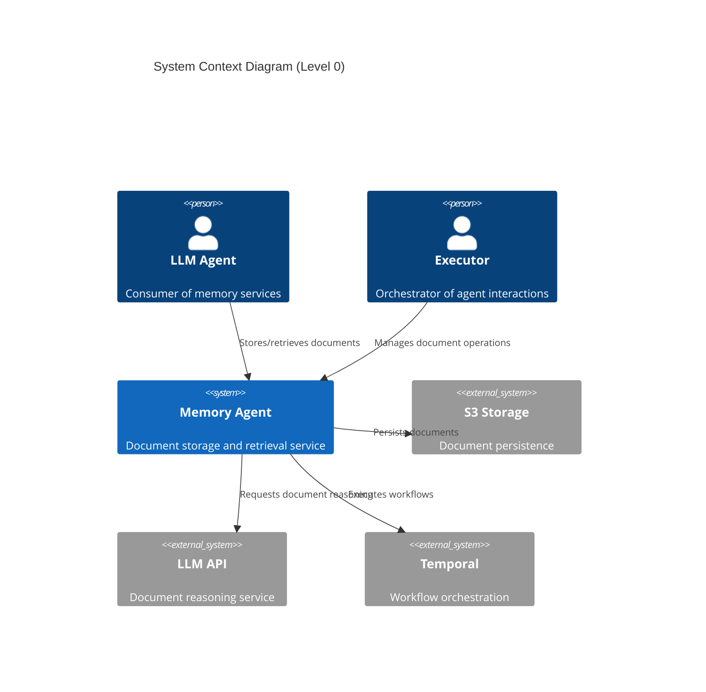
```mermaid
C4Context
    title System Context Diagram (Level 0)
    
    Person(agent, "LLM Agent", "Consumer of memory services")
    Person(executor, "Executor", "Orchestrator of agent interactions")
    
    System(memory, "Memory Agent", "Document storage and retrieval service")
    
    System_Ext(s3, "S3 Storage", "Document persistence")
    System_Ext(llm, "LLM API", "Document reasoning service")
    System_Ext(temporal, "Temporal", "Workflow orchestration")
    
    Rel(agent, memory, "Stores/retrieves documents")
    Rel(executor, memory, "Manages document operations")
    
    Rel(memory, s3, "Persists documents")
    Rel(memory, llm, "Requests document reasoning")
    Rel(memory, temporal, "Executes workflows")
```

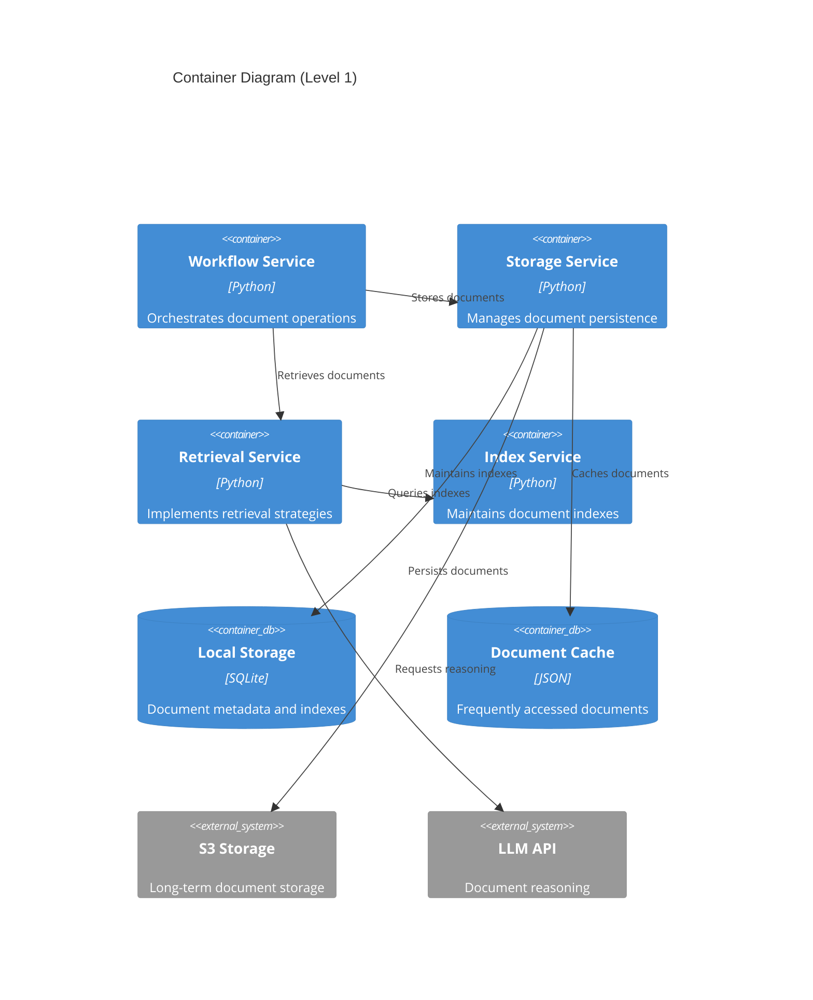
```mermaid
C4Container
    title Container Diagram (Level 1)
    
    Container(workflow, "Workflow Service", "Python", "Orchestrates document operations")
    Container(storage, "Storage Service", "Python", "Manages document persistence")
    Container(retrieval, "Retrieval Service", "Python", "Implements retrieval strategies")
    Container(index, "Index Service", "Python", "Maintains document indexes")
    
    ContainerDb(sqlite, "Local Storage", "SQLite", "Document metadata and indexes")
    ContainerDb(cache, "Document Cache", "JSON", "Frequently accessed documents")
    
    System_Ext(s3, "S3 Storage", "Long-term document storage")
    System_Ext(llm, "LLM API", "Document reasoning")
    
    Rel(workflow, storage, "Stores documents")
    Rel(workflow, retrieval, "Retrieves documents")
    Rel(storage, sqlite, "Maintains indexes")
    Rel(storage, cache, "Caches documents")
    Rel(storage, s3, "Persists documents")
    Rel(retrieval, llm, "Requests reasoning")
    Rel(retrieval, index, "Queries indexes")
```

## 2.2 Component Details

### 2.2.1 Core Components

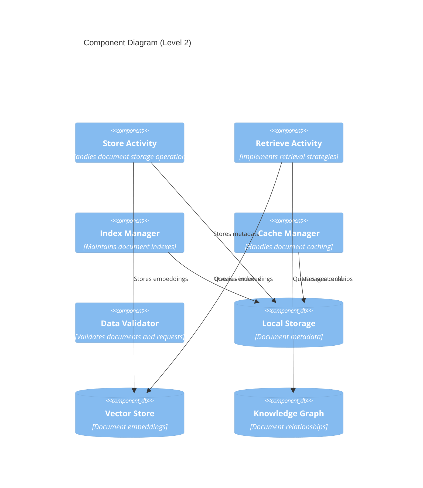
```mermaid
C4Component
    title Component Diagram (Level 2)
    
    Component(store, "Store Activity", "Handles document storage operations")
    Component(retrieve, "Retrieve Activity", "Implements retrieval strategies")
    Component(index, "Index Manager", "Maintains document indexes")
    Component(cache, "Cache Manager", "Handles document caching")
    Component(validator, "Data Validator", "Validates documents and requests")
    
    ComponentDb(local, "Local Storage", "Document metadata")
    ComponentDb(vector, "Vector Store", "Document embeddings")
    ComponentDb(graph, "Knowledge Graph", "Document relationships")
    
    Rel(store, local, "Stores metadata")
    Rel(store, vector, "Stores embeddings")
    Rel(retrieve, vector, "Queries embeddings")
    Rel(retrieve, graph, "Queries relationships")
    Rel(index, local, "Updates indexes")
    Rel(cache, local, "Manages cache")
```

| Component | Purpose | Technology | Scaling Strategy |
| --- | --- | --- | --- |
| Workflow Service | Orchestration | Temporal Python SDK | Horizontal worker scaling |
| Storage Service | Document persistence | Python/S3 SDK | S3 partitioning |
| Retrieval Service | Document retrieval | Python/LLM APIs | Worker pool scaling |
| Index Service | Document indexing | SQLite/JSON | Read replicas |

### 2.2.2 Data Flow

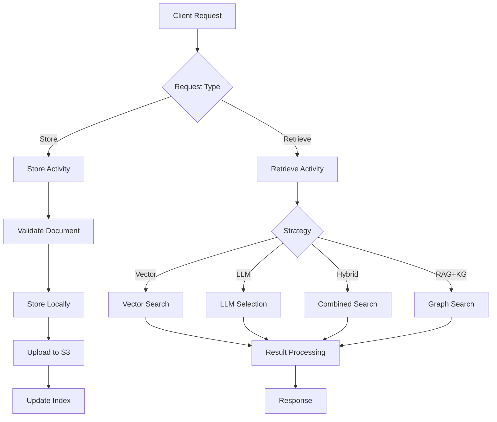
```mermaid
flowchart TD
    A[Client Request] --> B{Request Type}
    
    B -->|Store| C[Store Activity]
    C --> D[Validate Document]
    D --> E[Store Locally]
    E --> F[Upload to S3]
    F --> G[Update Index]
    
    B -->|Retrieve| H[Retrieve Activity]
    H --> I{Strategy}
    I -->|Vector| J[Vector Search]
    I -->|LLM| K[LLM Selection]
    I -->|Hybrid| L[Combined Search]
    I -->|RAG+KG| M[Graph Search]
    
    J --> N[Result Processing]
    K --> N
    L --> N
    M --> N
    N --> O[Response]
```

## 2.3 Technical Decisions

### 2.3.1 Architecture Choices

| Decision | Choice | Rationale |
| --- | --- | --- |
| Architecture Style | Workflow-based | Reliable orchestration, fault tolerance |
| Communication | Async/Event-driven | Better scalability, loose coupling |
| Storage | Multi-tier | Performance and durability balance |
| Caching | Local + Distributed | Improved read performance |
| Security | Token-based | Standard authentication pattern |

### 2.3.2 Deployment Architecture

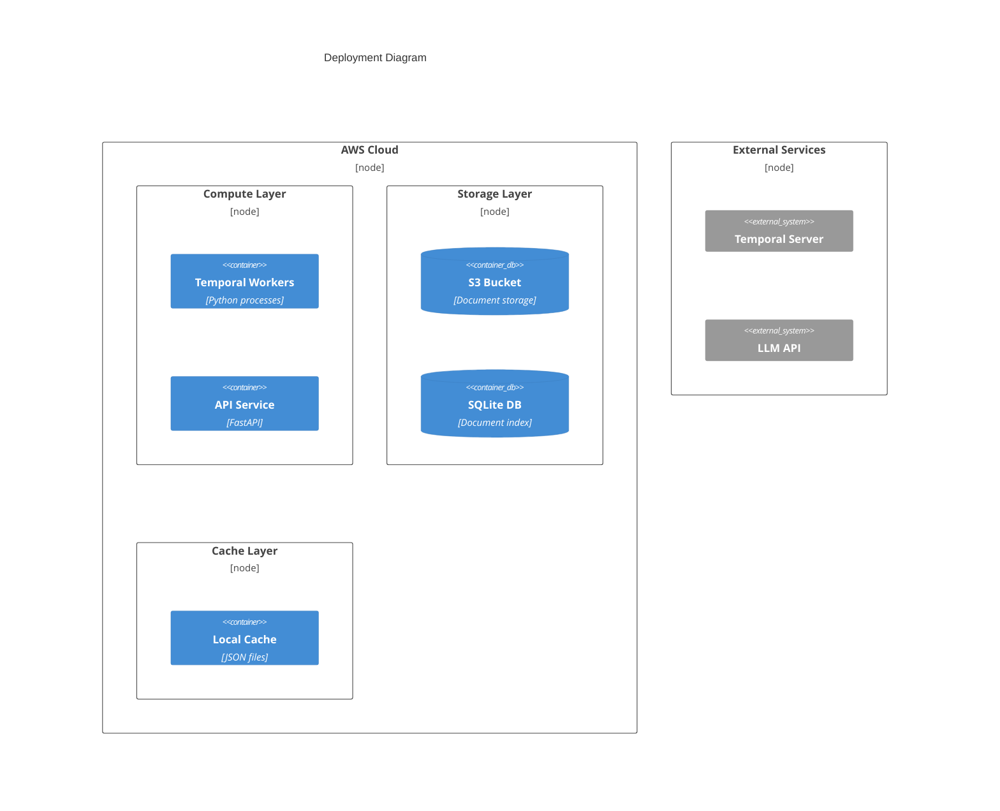
```mermaid
C4Deployment
    title Deployment Diagram
    
    Deployment_Node(aws, "AWS Cloud") {
        Deployment_Node(compute, "Compute Layer") {
            Container(workers, "Temporal Workers", "Python processes")
            Container(api, "API Service", "FastAPI")
        }
        
        Deployment_Node(storage, "Storage Layer") {
            ContainerDb(s3, "S3 Bucket", "Document storage")
            ContainerDb(sqlite, "SQLite DB", "Document index")
        }
        
        Deployment_Node(cache, "Cache Layer") {
            Container(local, "Local Cache", "JSON files")
        }
    }
    
    Deployment_Node(ext, "External Services") {
        System_Ext(temporal, "Temporal Server")
        System_Ext(llm, "LLM API")
    }
```

## 2.4 Cross-Cutting Concerns

### 2.4.1 Monitoring and Observability

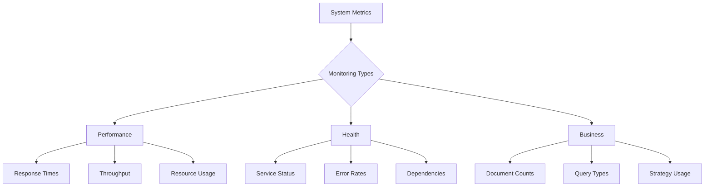
```mermaid
graph TD
    A[System Metrics] --> B{Monitoring Types}
    
    B --> C[Performance]
    C --> C1[Response Times]
    C --> C2[Throughput]
    C --> C3[Resource Usage]
    
    B --> D[Health]
    D --> D1[Service Status]
    D --> D2[Error Rates]
    D --> D3[Dependencies]
    
    B --> E[Business]
    E --> E1[Document Counts]
    E --> E2[Query Types]
    E --> E3[Strategy Usage]
```

### 2.4.2 Security Architecture

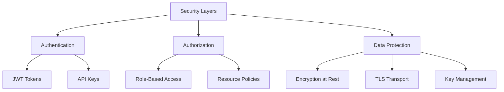
```mermaid
graph TD
    A[Security Layers] --> B[Authentication]
    A --> C[Authorization]
    A --> D[Data Protection]
    
    B --> B1[JWT Tokens]
    B --> B2[API Keys]
    
    C --> C1[Role-Based Access]
    C --> C2[Resource Policies]
    
    D --> D1[Encryption at Rest]
    D --> D2[TLS Transport]
    D --> D3[Key Management]
```

### 2.4.3 Error Handling and Recovery

| Component | Error Type | Recovery Strategy |
| --- | --- | --- |
| Workflow | Activity failure | Automatic retry with backoff |
| Storage | Write failure | Transaction rollback |
| Retrieval | LLM timeout | Fallback to vector search |
| Index | Corruption | Rebuild from S3 |

### 2.4.4 Performance Requirements

| Operation | Target Latency | Throughput |
| --- | --- | --- |
| Document Store | \< 2000ms | 50/sec |
| Vector Search | \< 3000ms | 100/sec |
| LLM Retrieval | \< 5000ms | 20/sec |
| Index Update | \< 1000ms | 200/sec |

# 3. SYSTEM COMPONENTS ARCHITECTURE

## 3.1 API DESIGN

### 3.1.1 API Architecture

| Component | Specification |
| --- | --- |
| Protocol | gRPC with HTTP/2 |
| Authentication | JWT Bearer tokens + mTLS for service-to-service |
| Rate Limiting | Token bucket: 100 req/min per client |
| Versioning | Semantic versioning in protobuf package names |
| Documentation | OpenAPI 3.0 + protobuf documentation |

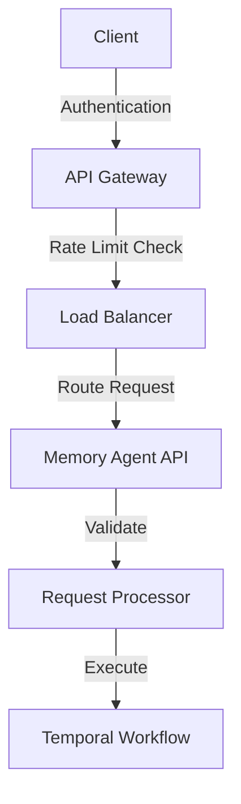
```mermaid
graph TD
    A[Client] -->|Authentication| B[API Gateway]
    B -->|Rate Limit Check| C[Load Balancer]
    C -->|Route Request| D[Memory Agent API]
    D -->|Validate| E[Request Processor]
    E -->|Execute| F[Temporal Workflow]
```

### 3.1.2 Interface Specifications

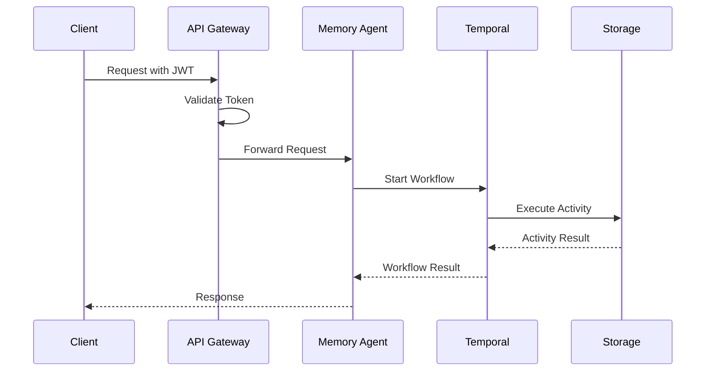
```mermaid
sequenceDiagram
    participant C as Client
    participant A as API Gateway
    participant M as Memory Agent
    participant T as Temporal
    participant S as Storage

    C->>A: Request with JWT
    A->>A: Validate Token
    A->>M: Forward Request
    M->>T: Start Workflow
    T->>S: Execute Activity
    S-->>T: Activity Result
    T-->>M: Workflow Result
    M-->>C: Response
```

| Endpoint | Method | Purpose | Request Format |
| --- | --- | --- | --- |
| /v1/documents/store | POST | Store document | DocumentModel |
| /v1/documents/retrieve | GET | Fetch document | GetRequestModel |
| /v1/documents/search | POST | Search documents | SearchRequestModel |
| /v1/health | GET | Service health | None |

### 3.1.3 Integration Requirements

| System | Integration Method | Requirements |
| --- | --- | --- |
| S3/Minio | SDK | Async operations, retry logic |
| LLM API | REST | Circuit breaker, timeout: 10s |
| Temporal | gRPC | Bi-directional streaming |
| Monitoring | OpenTelemetry | Trace sampling: 10% |

## 3.2 DATABASE DESIGN

### 3.2.1 Schema Design

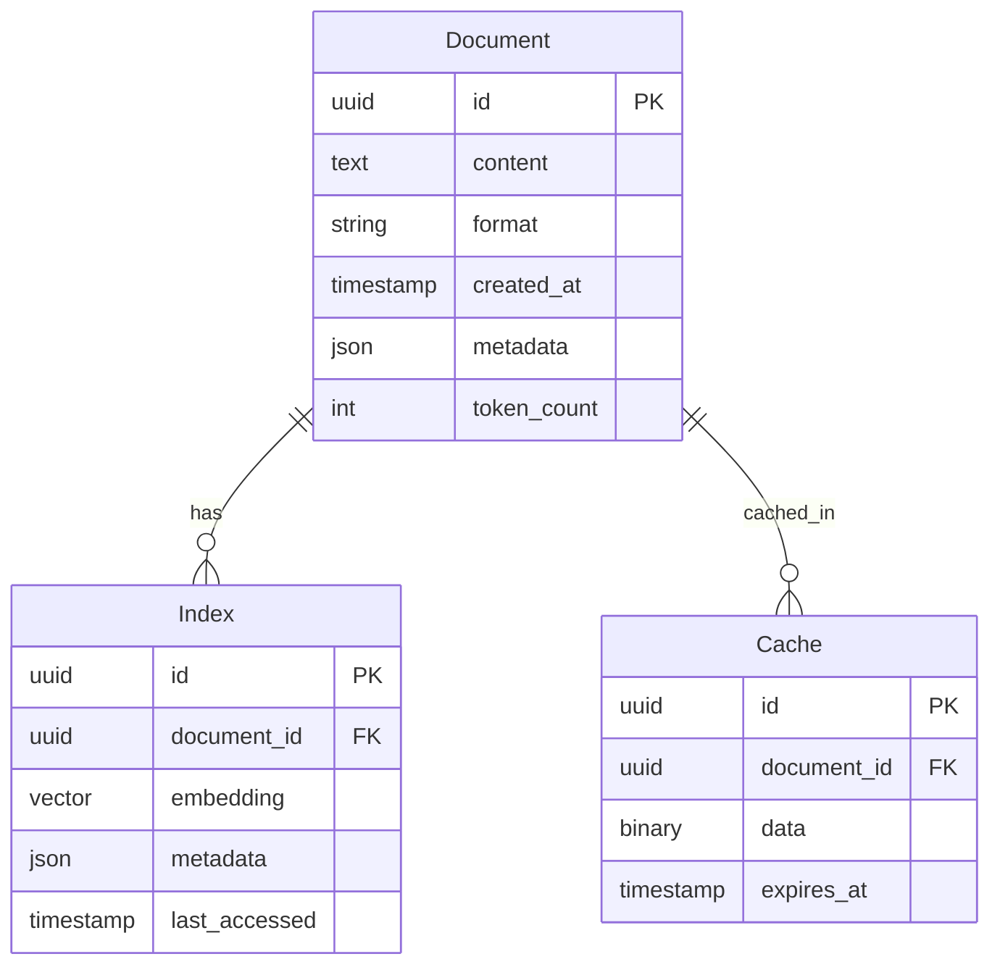
```mermaid
erDiagram
    Document {
        uuid id PK
        text content
        string format
        timestamp created_at
        json metadata
        int token_count
    }
    
    Index {
        uuid id PK
        uuid document_id FK
        vector embedding
        json metadata
        timestamp last_accessed
    }
    
    Cache {
        uuid id PK
        uuid document_id FK
        binary data
        timestamp expires_at
    }
    
    Document ||--o{ Index : has
    Document ||--o{ Cache : cached_in
```

### 3.2.2 Data Management

| Aspect | Strategy |
| --- | --- |
| Storage | SQLite for metadata, S3 for content |
| Indexing | B-tree for IDs, GiST for vectors |
| Caching | LRU with 1-hour TTL |
| Backup | Hourly incremental, daily full |
| Retention | 90 days active, 1 year archive |

### 3.2.3 Performance Optimization

| Strategy | Implementation |
| --- | --- |
| Query Cache | LRU cache for frequent queries |
| Index Strategy | Composite indexes on search fields |
| Partitioning | Date-based S3 prefixes |
| Replication | Read replicas for heavy load |

## 3.3 STORAGE ARCHITECTURE

### 3.3.1 Storage Components

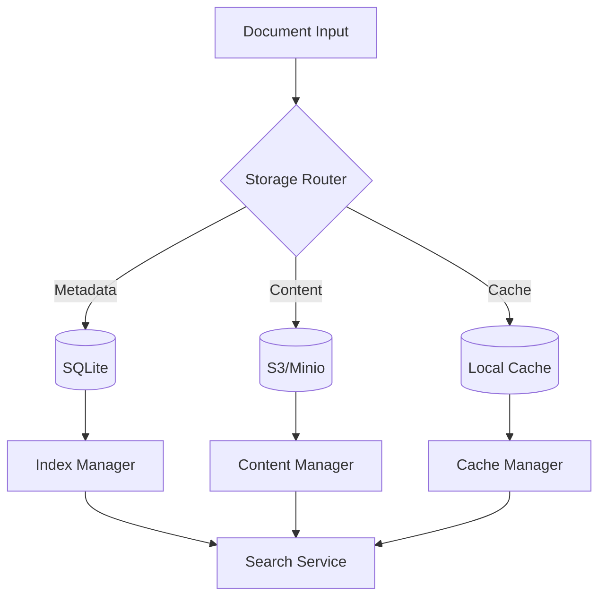
```mermaid
graph TD
    A[Document Input] --> B{Storage Router}
    B -->|Metadata| C[(SQLite)]
    B -->|Content| D[(S3/Minio)]
    B -->|Cache| E[(Local Cache)]
    
    C --> F[Index Manager]
    D --> G[Content Manager]
    E --> H[Cache Manager]
    
    F --> I[Search Service]
    G --> I
    H --> I
```

### 3.3.2 Storage Configuration

| Component | Configuration | Scaling Strategy |
| --- | --- | --- |
| SQLite | WAL mode, 64MB cache | Read replicas |
| S3/Minio | Versioning enabled | Bucket partitioning |
| Local Cache | 1GB max, LRU eviction | Per-instance scaling |
| Vector Store | HNSW index, 100K vectors | Distributed nodes |

### 3.3.3 Data Flow Management

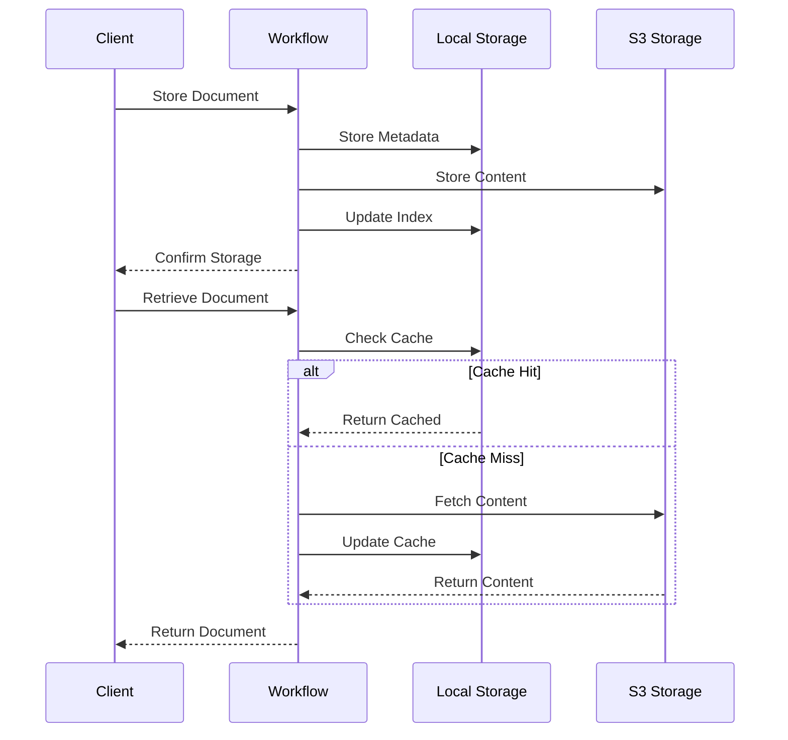
```mermaid
sequenceDiagram
    participant C as Client
    participant W as Workflow
    participant L as Local Storage
    participant S as S3 Storage
    
    C->>W: Store Document
    W->>L: Store Metadata
    W->>S: Store Content
    W->>L: Update Index
    W-->>C: Confirm Storage
    
    C->>W: Retrieve Document
    W->>L: Check Cache
    alt Cache Hit
        L-->>W: Return Cached
    else Cache Miss
        W->>S: Fetch Content
        W->>L: Update Cache
        S-->>W: Return Content
    end
    W-->>C: Return Document
```

### 3.3.4 Backup and Recovery

| Component | Backup Strategy | Recovery Time |
| --- | --- | --- |
| SQLite | Hourly WAL shipping | \< 5 minutes |
| S3 | Cross-region replication | \< 1 hour |
| Indexes | Rebuild from source | \< 30 minutes |
| Cache | No backup (ephemeral) | Immediate |

## 3.4 SECURITY ARCHITECTURE

### 3.4.1 Authentication and Authorization

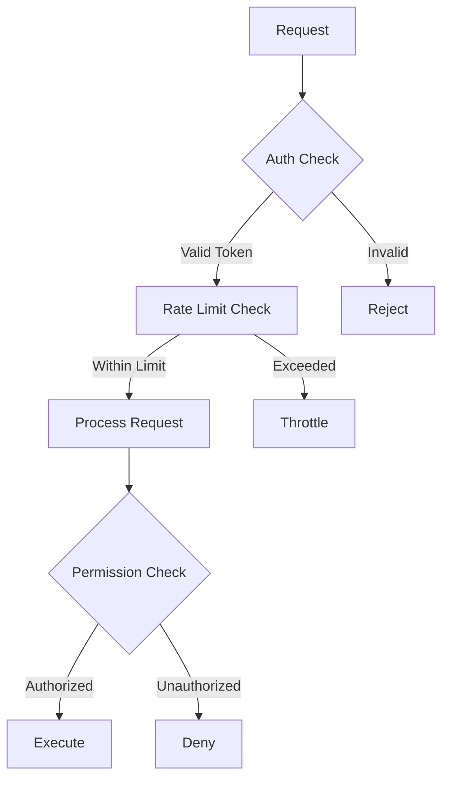
```mermaid
graph TD
    A[Request] --> B{Auth Check}
    B -->|Valid Token| C[Rate Limit Check]
    B -->|Invalid| D[Reject]
    C -->|Within Limit| E[Process Request]
    C -->|Exceeded| F[Throttle]
    E --> G{Permission Check}
    G -->|Authorized| H[Execute]
    G -->|Unauthorized| I[Deny]
```

### 3.4.2 Security Controls

| Control | Implementation |
| --- | --- |
| Authentication | JWT + mTLS |
| Authorization | RBAC with Temporal namespaces |
| Encryption | TLS 1.3 + S3 SSE |
| Key Management | AWS KMS |
| Audit Logging | CloudWatch + OpenTelemetry |

### 3.4.3 Data Protection

| Data Type | Protection Method |
| --- | --- |
| Documents | Encryption at rest |
| Metadata | Column-level encryption |
| Credentials | Environment variables |
| Tokens | Secure token storage |

# 4. TECHNOLOGY STACK

## 4.1 PROGRAMMING LANGUAGES

| Language | Version | Component | Justification |
| --- | --- | --- | --- |
| Python | 3.11+ | Core Service | - Strong async support for Temporal workflows<br>- Extensive ML/AI libraries<br>- Native S3 and LLM API integrations |
| SQL | SQLite3 | Local Storage | - Lightweight embedded database<br>- Zero-configuration setup<br>- ACID compliance for local operations |
| Protocol Buffers | 3 | API Definitions | - Efficient serialization<br>- Strong typing<br>- Native Temporal support |

## 4.2 FRAMEWORKS & LIBRARIES

### Core Frameworks

| Framework | Version | Purpose | Justification |
| --- | --- | --- | --- |
| Temporal SDK | 1.x | Workflow Engine | - Reliable workflow orchestration<br>- Built-in retry mechanisms<br>- Distributed execution support |
| FastAPI | 0.100+ | API Layer | - High performance async support<br>- Native Pydantic integration<br>- OpenAPI documentation |
| Pydantic | 2.x | Data Validation | - Type safety<br>- Schema validation<br>- Native FastAPI integration |

### Supporting Libraries

| Library | Version | Purpose |
| --- | --- | --- |
| boto3 | 1.28+ | S3 Integration |
| openai | 1.x | LLM API Access |
| SQLAlchemy | 2.0+ | Database ORM |
| aiohttp | 3.8+ | Async HTTP Client |
| prometheus-client | 0.17+ | Metrics Collection |
| opentelemetry-api | 1.x | Distributed Tracing |

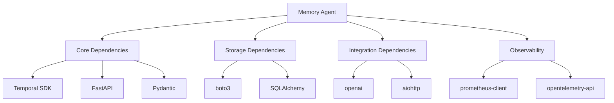
```mermaid
graph TD
    A[Memory Agent] --> B[Core Dependencies]
    B --> C[Temporal SDK]
    B --> D[FastAPI]
    B --> E[Pydantic]
    
    A --> F[Storage Dependencies]
    F --> G[boto3]
    F --> H[SQLAlchemy]
    
    A --> I[Integration Dependencies]
    I --> J[openai]
    I --> K[aiohttp]
    
    A --> L[Observability]
    L --> M[prometheus-client]
    L --> N[opentelemetry-api]
```

## 4.3 DATABASES & STORAGE

### Primary Storage

| Component | Technology | Purpose |
| --- | --- | --- |
| Document Store | S3/Minio | Long-term document persistence |
| Metadata DB | SQLite | Document indexing and metadata |
| Vector Store | FAISS/Milvus | Optional embedding storage |
| Graph Store | NetworkX | Optional knowledge graph storage |

### Caching Strategy

| Layer | Technology | Purpose |
| --- | --- | --- |
| Memory Cache | LRU Cache | Frequent document access |
| Local Cache | SQLite | Document metadata |
| File Cache | JSON Files | Temporary document storage |

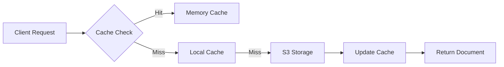
```mermaid
graph LR
    A[Client Request] --> B{Cache Check}
    B -->|Hit| C[Memory Cache]
    B -->|Miss| D[Local Cache]
    D -->|Miss| E[S3 Storage]
    
    E --> F[Update Cache]
    F --> G[Return Document]
```

## 4.4 THIRD-PARTY SERVICES

| Service | Purpose | Integration Method |
| --- | --- | --- |
| S3/Minio | Document Storage | boto3 SDK |
| OpenAI API | LLM Processing | REST API |
| Temporal Cloud | Workflow Orchestration | gRPC |
| Prometheus | Metrics Collection | HTTP Export |
| Jaeger | Distributed Tracing | OTLP |

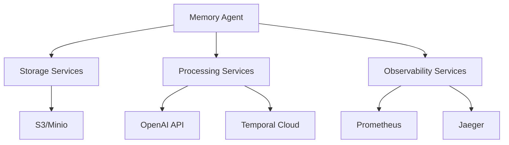
```mermaid
graph TD
    A[Memory Agent] --> B[Storage Services]
    A --> C[Processing Services]
    A --> D[Observability Services]
    
    B --> E[S3/Minio]
    C --> F[OpenAI API]
    C --> G[Temporal Cloud]
    
    D --> H[Prometheus]
    D --> I[Jaeger]
```

## 4.5 DEVELOPMENT & DEPLOYMENT

### Development Tools

| Tool | Version | Purpose |
| --- | --- | --- |
| Poetry | 1.5+ | Dependency Management |
| Black | 23.+ | Code Formatting |
| Pytest | 7.4+ | Testing Framework |
| mypy | 1.5+ | Static Type Checking |
| pre-commit | 3.3+ | Git Hooks |

### Containerization

| Component | Technology | Purpose |
| --- | --- | --- |
| Runtime | Docker | Service Containerization |
| Orchestration | Docker Compose | Local Development |
| Registry | AWS ECR | Container Registry |

### CI/CD Pipeline

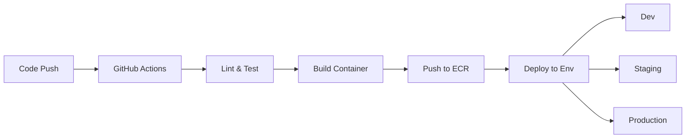
```mermaid
graph LR
    A[Code Push] --> B[GitHub Actions]
    B --> C[Lint & Test]
    C --> D[Build Container]
    D --> E[Push to ECR]
    E --> F[Deploy to Env]
    
    F --> G[Dev]
    F --> H[Staging]
    F --> I[Production]
```

| Stage | Tools | Purpose |
| --- | --- | --- |
| Source Control | Git/GitHub | Version Control |
| CI/CD | GitHub Actions | Automation Pipeline |
| Quality Gates | SonarQube | Code Quality |
| Deployment | AWS ECS | Container Orchestration |

# 5. SYSTEM DESIGN

## 5.1 DATABASE DESIGN

### 5.1.1 Schema Design

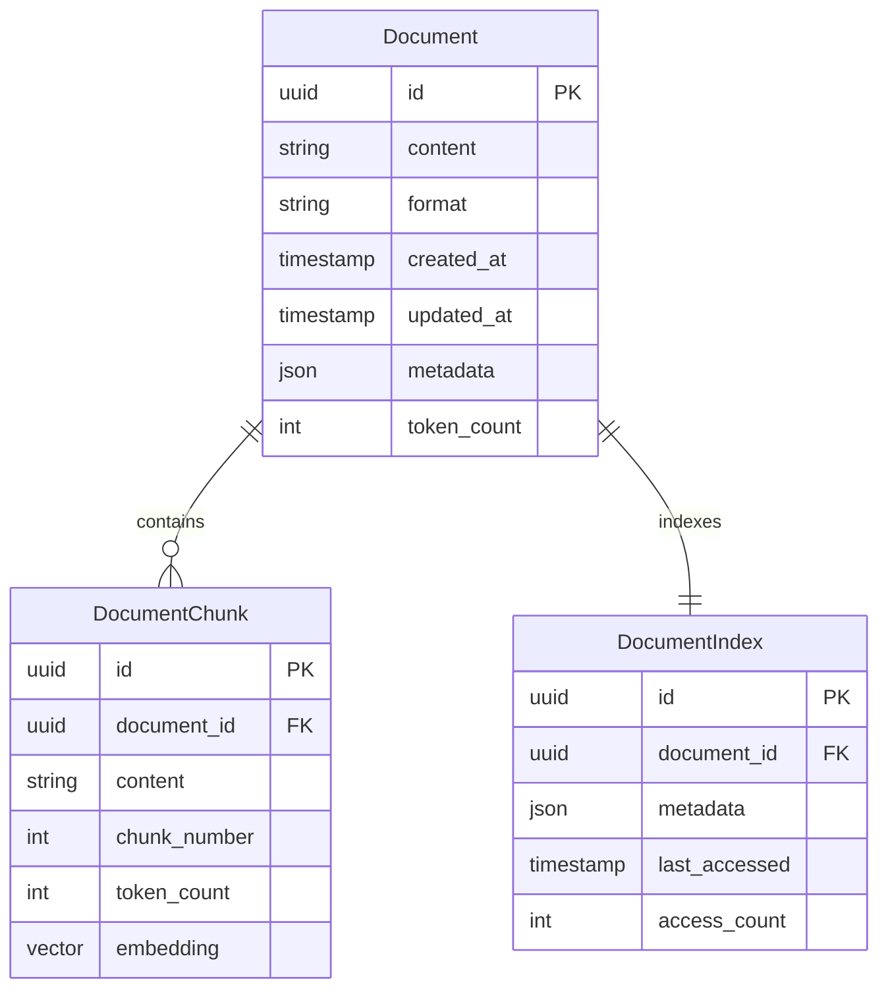
```mermaid
erDiagram
    Document {
        uuid id PK
        string content
        string format
        timestamp created_at
        timestamp updated_at
        json metadata
        int token_count
    }

    DocumentChunk {
        uuid id PK
        uuid document_id FK
        string content
        int chunk_number
        int token_count
        vector embedding
    }

    DocumentIndex {
        uuid id PK
        uuid document_id FK
        json metadata
        timestamp last_accessed
        int access_count
    }

    Document ||--o{ DocumentChunk : contains
    Document ||--|| DocumentIndex : indexes
```

### 5.1.2 Storage Schema

| Table | Storage Engine | Purpose |
| --- | --- | --- |
| documents | SQLite | Document metadata and content |
| document_chunks | SQLite | Tokenized document segments |
| document_indexes | SQLite | Search and retrieval indexes |
| embeddings | Vector Store | Document embeddings |
| cache | JSON Files | Temporary document storage |

### 5.1.3 Index Design

| Index Name | Table | Columns | Type | Purpose |
| --- | --- | --- | --- | --- |
| idx_doc_id | documents | id | B-tree | Primary key lookup |
| idx_doc_metadata | documents | metadata | GIN | JSON metadata search |
| idx_doc_created | documents | created_at | B-tree | Temporal queries |
| idx_chunk_embedding | document_chunks | embedding | HNSW | Vector similarity |

## 5.2 API DESIGN

### 5.2.1 Core Endpoints

| Endpoint | Method | Purpose | Request Model | Response Model |
| --- | --- | --- | --- | --- |
| /v1/documents/store | POST | Store document | StoreRequestModel | StoreResponseModel |
| /v1/documents/retrieve | GET | Fetch document | GetRequestModel | GetResponseModel |
| /v1/documents/search | POST | Search documents | SearchRequestModel | SearchResponseModel |
| /v1/health | GET | Service health | None | HealthResponse |

### 5.2.2 API Flow

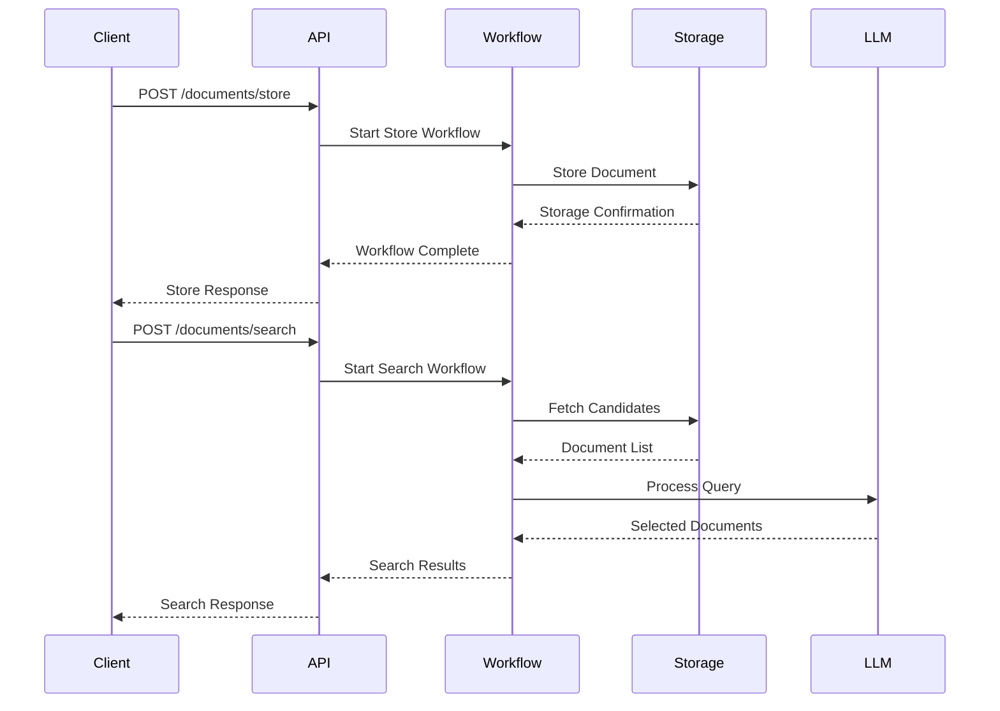
```mermaid
sequenceDiagram
    participant Client
    participant API
    participant Workflow
    participant Storage
    participant LLM

    Client->>API: POST /documents/store
    API->>Workflow: Start Store Workflow
    Workflow->>Storage: Store Document
    Storage-->>Workflow: Storage Confirmation
    Workflow-->>API: Workflow Complete
    API-->>Client: Store Response

    Client->>API: POST /documents/search
    API->>Workflow: Start Search Workflow
    Workflow->>Storage: Fetch Candidates
    Storage-->>Workflow: Document List
    Workflow->>LLM: Process Query
    LLM-->>Workflow: Selected Documents
    Workflow-->>API: Search Results
    API-->>Client: Search Response
```

### 5.2.3 Request/Response Models

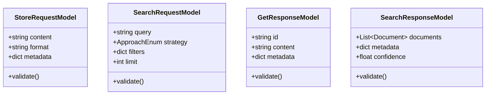
```mermaid
classDiagram
    class StoreRequestModel {
        +string content
        +string format
        +dict metadata
        +validate()
    }

    class SearchRequestModel {
        +string query
        +ApproachEnum strategy
        +dict filters
        +int limit
        +validate()
    }

    class GetResponseModel {
        +string id
        +string content
        +dict metadata
        +validate()
    }

    class SearchResponseModel {
        +List~Document~ documents
        +dict metadata
        +float confidence
        +validate()
    }
```

## 5.3 COMMAND LINE INTERFACE

### 5.3.1 CLI Commands

| Command | Purpose | Arguments | Example |
| --- | --- | --- | --- |
| store | Store document | --file, --format, --metadata | `memory-agent store --file doc.md` |
| retrieve | Get document | --id, --strategy | `memory-agent retrieve --id abc123` |
| search | Search documents | --query, --strategy, --limit | `memory-agent search --query "context"` |
| health | Check service | None | `memory-agent health` |

### 5.3.2 CLI Output Format

```bash
# Store Document
$ memory-agent store --file doc.md
{
  "status": "success",
  "document_id": "abc123",
  "metadata": {
    "format": "markdown",
    "tokens": 150
  }
}

# Search Documents
$ memory-agent search --query "context" --strategy llm
{
  "status": "success",
  "documents": [
    {
      "id": "abc123",
      "content": "...",
      "confidence": 0.95
    }
  ],
  "metadata": {
    "strategy": "llm",
    "time_taken": "2.5s"
  }
}
```

## 5.4 STORAGE DESIGN

### 5.4.1 Storage Architecture

```mermaid
graph TD
    A[Document Input] --> B{Storage Router}
    B -->|Metadata| C[(SQLite)]
    B -->|Content| D[(S3/Minio)]
    B -->|Cache| E[(Local Cache)]
    
    C --> F[Index Manager]
    D --> G[Content Manager]
    E --> H[Cache Manager]
    
    F --> I[Search Service]
    G --> I
    H --> I
```

### 5.4.2 Storage Configuration

| Component | Configuration | Purpose |
| --- | --- | --- |
| SQLite | WAL Mode | Document metadata and indexes |
| S3/Minio | Versioning enabled | Long-term document storage |
| Local Cache | LRU, 1GB max | Frequently accessed documents |
| Vector Store | HNSW index | Embedding similarity search |

### 5.4.3 Caching Strategy

| Cache Type | Implementation | Eviction Policy | Size Limit |
| --- | --- | --- | --- |
| Memory Cache | LRU Cache | Time-based (1 hour) | 1GB |
| Disk Cache | SQLite | LRU (1 day) | 10GB |
| Result Cache | Redis | LRU (15 minutes) | 5GB |
| Embedding Cache | Memory mapped | Size-based | 2GB |

# 6. USER INTERFACE DESIGN

No user interface required. The Memory Agent is designed as a backend service that interacts through:

- Temporal workflow APIs
- gRPC/REST endpoints
- Direct code integration

All interactions are programmatic through the defined APIs and workflows as specified in sections 3.1 API Design and 3.2 Database Design.

# 7. SECURITY CONSIDERATIONS

## 7.1 AUTHENTICATION AND AUTHORIZATION

### 7.1.1 Authentication Flow

```mermaid
sequenceDiagram
    participant Agent
    participant Gateway
    participant Auth
    participant Memory
    participant Temporal
    
    Agent->>Gateway: Request with JWT
    Gateway->>Auth: Validate Token
    Auth-->>Gateway: Token Valid
    Gateway->>Memory: Forward Request
    Memory->>Temporal: Start Workflow
    Temporal-->>Memory: Workflow Result
    Memory-->>Agent: Response
```

### 7.1.2 Authorization Matrix

| Role | Store Documents | Retrieve Documents | Search | Admin Operations |
| --- | --- | --- | --- | --- |
| Agent | Yes | Yes | Yes | No |
| Executor | Yes | Yes | Yes | Yes |
| Admin | Yes | Yes | Yes | Yes |
| System | Yes | Yes | Yes | Yes |

### 7.1.3 Access Control Implementation

| Component | Method | Implementation |
| --- | --- | --- |
| API Gateway | JWT Bearer Tokens | FastAPI security middleware |
| Service-to-Service | mTLS | Temporal TLS certificates |
| S3 Access | IAM Roles | AWS credentials |
| LLM API | API Keys | Environment variables |
| Internal APIs | Service Tokens | JWT with limited scope |

## 7.2 DATA SECURITY

### 7.2.1 Data Protection Layers

```mermaid
graph TD
    A[Data Security] --> B[Transport Security]
    A --> C[Storage Security]
    A --> D[Processing Security]
    
    B --> B1[TLS 1.3]
    B --> B2[mTLS]
    
    C --> C1[S3 Encryption]
    C --> C2[SQLite Encryption]
    C --> C3[Memory Protection]
    
    D --> D1[Secure Processing]
    D --> D2[Memory Wiping]
    D --> D3[Token Management]
```

### 7.2.2 Encryption Standards

| Layer | Standard | Implementation |
| --- | --- | --- |
| Data at Rest | AES-256 | S3 SSE-KMS |
| Data in Transit | TLS 1.3 | Python ssl library |
| Database | SQLite Encryption | SQLCipher |
| API Tokens | HMAC SHA-256 | JWT encryption |
| Secrets | KMS | AWS KMS |

### 7.2.3 Data Classification

| Data Type | Classification | Protection Level |
| --- | --- | --- |
| Document Content | Confidential | Encrypted at rest and in transit |
| Document Metadata | Internal | Encrypted at rest |
| System Logs | Internal | Encrypted at rest |
| Authentication Tokens | Restricted | Encrypted in memory |
| Configuration Data | Internal | Environment variables |

## 7.3 SECURITY PROTOCOLS

### 7.3.1 Security Monitoring

```mermaid
graph LR
    A[Security Monitoring] --> B{Monitor Types}
    B --> C[Access Logs]
    B --> D[Security Events]
    B --> E[System Metrics]
    
    C --> C1[API Access]
    C --> C2[S3 Access]
    C --> C3[Auth Events]
    
    D --> D1[Auth Failures]
    D --> D2[Policy Violations]
    D --> D3[Suspicious Activity]
    
    E --> E1[Resource Usage]
    E --> E2[Error Rates]
    E --> E3[API Latency]
```

### 7.3.2 Security Controls

| Control Type | Implementation | Purpose |
| --- | --- | --- |
| Rate Limiting | Token bucket algorithm | Prevent abuse |
| Input Validation | Pydantic models | Prevent injection |
| Session Management | JWT expiration | Secure access |
| Error Handling | Sanitized responses | Prevent information disclosure |
| Audit Logging | CloudWatch | Security tracking |

### 7.3.3 Security Compliance

| Requirement | Implementation | Validation |
| --- | --- | --- |
| Access Control | RBAC | Regular audit |
| Data Protection | Encryption | Automated testing |
| Secure Communication | TLS/mTLS | Certificate validation |
| Secret Management | KMS | Access review |
| Audit Trail | Structured logging | Log analysis |

### 7.3.4 Incident Response

| Phase | Actions | Responsibility |
| --- | --- | --- |
| Detection | Monitor security events | System |
| Analysis | Evaluate security alerts | Admin |
| Containment | Isolate affected components | System/Admin |
| Eradication | Remove security threats | Admin |
| Recovery | Restore secure operation | System/Admin |
| Review | Update security measures | Admin |

# 8. INFRASTRUCTURE

## 8.1 DEPLOYMENT ENVIRONMENT

The Memory Agent is designed for cloud-native deployment with local development capabilities.

| Environment | Purpose | Configuration |
| --- | --- | --- |
| Development | Local development and testing | Docker Compose with local Minio and SQLite |
| Staging | Integration testing and validation | AWS with reduced resource allocation |
| Production | Live system operation | AWS with full HA configuration |

### Environment Requirements

| Component | Development | Staging | Production |
| --- | --- | --- | --- |
| CPU | 2 cores | 4 cores | 8+ cores |
| Memory | 4GB | 8GB | 16GB+ |
| Storage | 20GB SSD | 100GB SSD | 500GB+ SSD |
| Network | 100Mbps | 1Gbps | 10Gbps |

## 8.2 CLOUD SERVICES

Primary cloud provider: AWS

| Service | Purpose | Configuration |
| --- | --- | --- |
| ECS Fargate | Container hosting | Auto-scaling, spot instances |
| S3 | Document storage | Versioning enabled, SSE-KMS |
| CloudWatch | Monitoring and logging | Custom metrics, log retention |
| Route 53 | DNS management | Health checks, failover |
| KMS | Key management | Automatic key rotation |
| ECR | Container registry | Image scanning enabled |

```mermaid
graph TD
    A[Memory Agent] --> B{AWS Services}
    B --> C[ECS Fargate]
    B --> D[S3]
    B --> E[CloudWatch]
    B --> F[Route 53]
    B --> G[KMS]
    B --> H[ECR]
    
    C --> I[Service Tasks]
    D --> J[Document Storage]
    E --> K[Monitoring]
    F --> L[DNS]
    G --> M[Encryption]
    H --> N[Container Images]
```

## 8.3 CONTAINERIZATION

Docker-based containerization strategy:

| Component | Base Image | Purpose |
| --- | --- | --- |
| Memory Agent | python:3.11-slim | Core service container |
| Temporal Worker | temporalio/base | Workflow execution |
| Development Tools | python:3.11 | Local development |

### Container Configuration

```mermaid
graph TD
    A[Base Image] --> B[Python 3.11 Slim]
    B --> C[System Dependencies]
    C --> D[Python Dependencies]
    D --> E[Application Code]
    E --> F[Configuration]
    
    subgraph Container
        C
        D
        E
        F
    end
```

## 8.4 ORCHESTRATION

ECS Fargate for production, Docker Compose for development:

| Component | Development | Production |
| --- | --- | --- |
| Orchestrator | Docker Compose | ECS Fargate |
| Service Discovery | Docker DNS | AWS Service Discovery |
| Load Balancing | Traefik | Application Load Balancer |
| Scaling | Manual | Auto-scaling |

### Service Configuration

```mermaid
graph TD
    A[ECS Cluster] --> B{Service Types}
    B --> C[Memory Agent Service]
    B --> D[Temporal Worker Service]
    
    C --> E[Task Definition]
    E --> F[Container Definition]
    F --> G[Resource Limits]
    F --> H[Environment]
    F --> I[Networking]
    
    D --> J[Worker Task Definition]
    J --> K[Worker Container]
    K --> L[Resource Limits]
    K --> M[Environment]
```

## 8.5 CI/CD PIPELINE

GitHub Actions-based pipeline:

```mermaid
graph LR
    A[Code Push] --> B[GitHub Actions]
    B --> C{Test & Build}
    C --> D[Unit Tests]
    C --> E[Integration Tests]
    C --> F[Build Container]
    
    D --> G{Quality Gates}
    E --> G
    F --> G
    
    G -->|Pass| H[Push to ECR]
    G -->|Fail| I[Notify Team]
    
    H --> J{Deploy}
    J --> K[Staging]
    K -->|Success| L[Production]
```

### Pipeline Stages

| Stage | Tools | Purpose |
| --- | --- | --- |
| Code Analysis | Black, mypy, pylint | Code quality |
| Testing | pytest, coverage | Test execution |
| Security Scan | Snyk, Trivy | Vulnerability detection |
| Build | Docker | Container creation |
| Deploy | AWS CDK | Infrastructure deployment |

### Environment Promotion

| Environment | Trigger | Validation |
| --- | --- | --- |
| Development | Push to feature branch | Automated tests |
| Staging | Push to main | Integration tests |
| Production | Manual approval | Load testing |

### Deployment Configuration

```mermaid
graph TD
    A[GitHub Actions] --> B{Environment}
    B --> C[Development]
    B --> D[Staging]
    B --> E[Production]
    
    C --> F[Auto Deploy]
    D --> G[Auto Deploy]
    E --> H[Manual Approval]
    
    F --> I[Dev ECS]
    G --> J[Staging ECS]
    H --> K[Prod ECS]
```

# APPENDICES

## A.1 ADDITIONAL TECHNICAL INFORMATION

### A.1.1 Token Management Strategy

| Component | Token Limit | Handling Strategy |
| --- | --- | --- |
| GPT-3.5 | 16K tokens | Chunk documents into 4K segments |
| GPT-4 | 32K tokens | Chunk documents into 8K segments |
| Vector Store | N/A | Store full embeddings |
| Knowledge Graph | N/A | Store entity relationships |

### A.1.2 Fallback Mechanisms

```mermaid
flowchart TD
    A[Retrieval Request] --> B{Primary Strategy}
    B -->|Success| C[Return Results]
    B -->|Failure| D{Fallback Chain}
    
    D -->|LLM Failure| E[Vector Search]
    D -->|Vector Failure| F[Metadata Search]
    D -->|All Failed| G[Error Response]
    
    E -->|Success| C
    F -->|Success| C
```

### A.1.3 Cache Invalidation Strategy

| Cache Type | Invalidation Trigger | TTL |
| --- | --- | --- |
| Document Cache | Document Update | 1 hour |
| Embedding Cache | Content Change | 24 hours |
| Query Cache | Strategy Change | 15 minutes |
| Graph Cache | Relationship Update | 6 hours |

## A.2 GLOSSARY

| Term | Definition |
| --- | --- |
| Activity | Individual unit of work within a Temporal workflow |
| Circuit Breaker | Design pattern that prevents cascading failures |
| Document Chunking | Process of splitting documents into manageable segments |
| Embedding | Vector representation of text for similarity search |
| Knowledge Graph | Network structure representing document relationships |
| RAG | Technique combining retrieval with LLM generation |
| Token | Basic text unit for LLM processing |
| Vector Search | Similarity-based document retrieval method |
| Workflow | Orchestrated sequence of activities |
| Worker | Process executing Temporal activities |

## A.3 ACRONYMS

| Acronym | Full Form |
| --- | --- |
| API | Application Programming Interface |
| AWS | Amazon Web Services |
| CRUD | Create, Read, Update, Delete |
| ECR | Elastic Container Registry |
| ECS | Elastic Container Service |
| HNSW | Hierarchical Navigable Small World |
| IAM | Identity and Access Management |
| JWT | JSON Web Token |
| KMS | Key Management Service |
| LLM | Large Language Model |
| LRU | Least Recently Used |
| mTLS | mutual Transport Layer Security |
| OTLP | OpenTelemetry Protocol |
| RAG | Retrieval Augmented Generation |
| REST | Representational State Transfer |
| S3 | Simple Storage Service |
| SDK | Software Development Kit |
| SNS | Simple Notification Service |
| SQL | Structured Query Language |
| SSE | Server-Side Encryption |
| TLS | Transport Layer Security |
| TTL | Time To Live |
| WAL | Write-Ahead Logging |

## A.4 REFERENCES

| Resource | Description | URL |
| --- | --- | --- |
| Temporal Docs | Official Temporal documentation | https://docs.temporal.io |
| OpenAI API | LLM integration reference | https://platform.openai.com/docs |
| AWS S3 SDK | Python boto3 documentation | https://boto3.amazonaws.com/v1/documentation/api/latest/reference/services/s3.html |
| Pydantic | Data validation library | https://docs.pydantic.dev |
| FastAPI | API framework documentation | https://fastapi.tiangolo.com |
| SQLite | Database documentation | https://www.sqlite.org/docs.html |
| OpenTelemetry | Observability framework | https://opentelemetry.io/docs |
| Docker | Container platform docs | https://docs.docker.com |