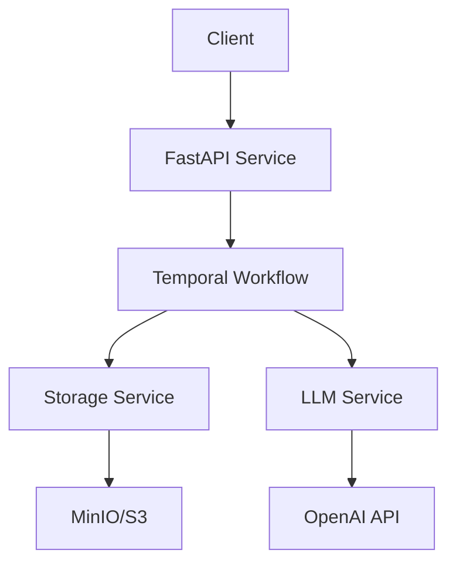

# Memory Agent Backend Service

[](https://github.com/yourusername/memory-agent/actions)
[](https://github.com/yourusername/memory-agent/releases)
[](LICENSE)

- [Overview](#overview)
- [Prerequisites](#prerequisites)
- [Development Setup](#development-setup)
- [Production Deployment](#production-deployment)
- [Architecture](#architecture)
- [API Documentation](#api-documentation)
- [Security](#security)
- [Monitoring](#monitoring)
- [Contributing](#contributing)
- [Troubleshooting](#troubleshooting)

## Overview

The Memory Agent is a Temporal workflow-based document storage and retrieval service designed to serve as an intelligent memory layer for LLM-based agents. The system implements multiple retrieval strategies including vector-based search, pure LLM reasoning, hybrid approaches, and RAG with Knowledge Graphs.

Key Features:
- Document storage and indexing with S3/MinIO
- Multi-strategy document retrieval
- Token-aware document chunking
- Fault-tolerant Temporal workflows
- Production-ready monitoring and observability

## Prerequisites

- Python 3.11 or higher
- Docker and Docker Compose
- Poetry 1.5+
- Make (optional, for convenience commands)

## Development Setup

### 1. Environment Configuration

Clone the repository and create your environment file:

```bash
cp .env.example .env
```

Required environment variables:
```bash
PYTHONPATH=/app/src
APP_ENV=development
DEBUG=true
MINIO_ROOT_USER=minioadmin
MINIO_ROOT_PASSWORD=minioadmin
```

### 2. Local Development

Start the development environment:

```bash
# Install dependencies
poetry install

# Start services with hot-reload
docker-compose -f docker-compose.dev.yml up
```

Development services will be available at:
- FastAPI Application: http://localhost:8000
- MinIO Console: http://localhost:9001
- Temporal UI: http://localhost:8233
- Remote Debugger Port: 5678

### 3. Testing and Linting

```bash
# Run tests
poetry run pytest

# Format code
poetry run black src tests

# Type checking
poetry run mypy src
```

## Production Deployment

### 1. Environment Setup

Configure production environment variables:
```bash
APP_ENV=production
DEBUG=false
```

### 2. Container Deployment

```bash
# Build and start services
docker-compose up -d

# View logs
docker-compose logs -f

# Stop services
docker-compose down
```

Production ports:
- FastAPI Application: 8000
- MinIO S3 API: 9000
- Temporal gRPC: 7233
- Elasticsearch API: 9200

## Architecture



### Components
- **API Layer**: FastAPI application handling HTTP requests
- **Workflow Engine**: Temporal-based workflow orchestration
- **Storage Layer**: S3/MinIO document storage with SQLite metadata
- **Retrieval Engine**: Multi-strategy document retrieval system

## API Documentation

### Core Endpoints

| Endpoint | Method | Description |
|----------|---------|-------------|
| /v1/documents/store | POST | Store new document |
| /v1/documents/retrieve | GET | Retrieve document by ID |
| /v1/documents/search | POST | Search documents |
| /v1/health | GET | Service health check |

Full API documentation available at `/docs` (Swagger UI) and `/redoc` (ReDoc).

## Security

### Authentication
- JWT-based authentication
- mTLS for service-to-service communication
- API key management for external services

### Best Practices
- All secrets managed via environment variables
- Regular security updates
- Encrypted data at rest and in transit
- Comprehensive audit logging

## Monitoring

### Health Checks
- `/v1/health`: Basic service health
- `/v1/health/live`: Liveness probe
- `/v1/health/ready`: Readiness probe

### Metrics
- Prometheus metrics at `/metrics`
- Custom business metrics
- Temporal workflow metrics

### Logging
- Structured JSON logging
- Log levels configurable via environment
- OpenTelemetry trace correlation

## Contributing

1. Fork the repository
2. Create a feature branch
3. Implement changes with tests
4. Submit a pull request

Code Style:
- Follow Black formatting
- 100% test coverage for new code
- Comprehensive docstrings
- Type hints required

## Troubleshooting

Common Issues:
1. **Service Won't Start**
   - Check Docker daemon
   - Verify port availability
   - Validate environment variables

2. **Workflow Failures**
   - Check Temporal UI
   - Verify activity timeouts
   - Review error logs

3. **Performance Issues**
   - Monitor resource usage
   - Check connection pools
   - Review cache hit rates

Support:
- GitHub Issues for bug reports
- Internal team chat for urgent issues
- Documentation wiki for guides

## License

MIT License - see [LICENSE](LICENSE) for details